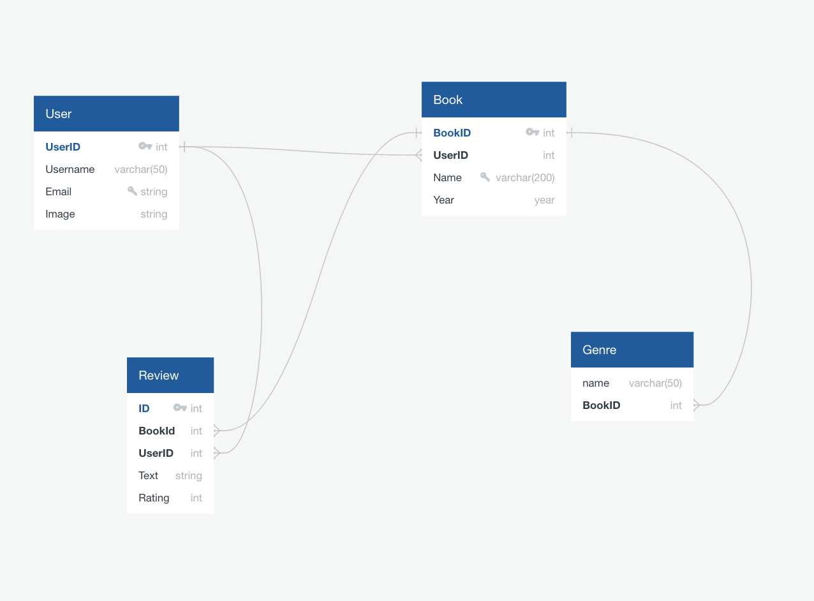
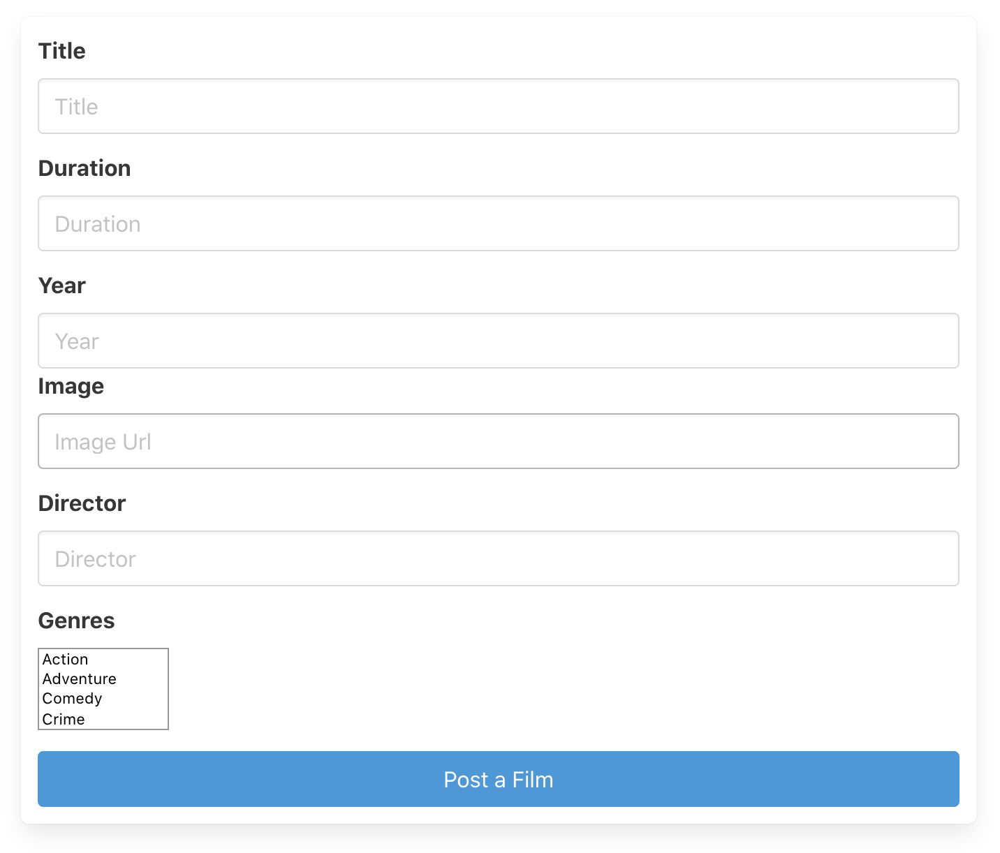
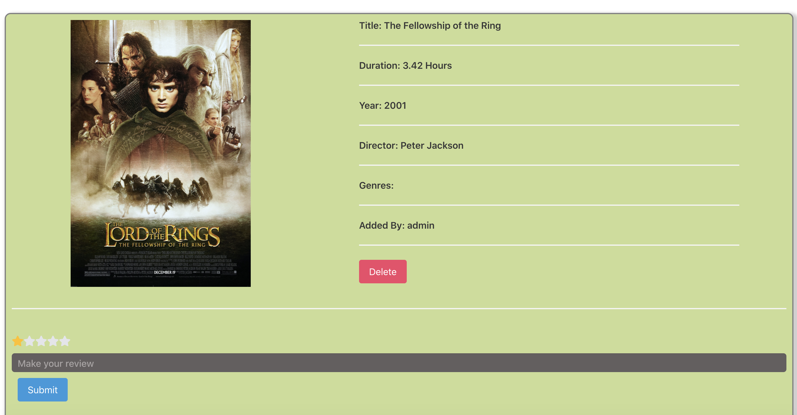

# final-project

General Assembly Project 4 : - Film-Space

## https://film-space-django.herokuapp.com/

## Goal: 
To create a full-stack app using Python for the BackEnd, and React.js with some libraries for the FrontEnd.

Timeframe: 7 days

## Table of Contents

- [Overview](#overview)
- [Process](#process)
- [Technologies](#technologies)
- [Win](#win)
- [Challenges](#challenges)
- [Lesson](#lesson)

## Overview

Film-Space is a RESTful full stack film review app allowing users to add films and make reviews of them. Users will be able to give their rating and opinion about films to help other users.

## Technologies

### BackEnd

- Django Rest Framework
- JWT Auth
- Python
- Postgres

### FrontEnd

- React.js
- Bulma
- npm
- React-star-ratings

## Process

The starting point was to create the database using Django and Python. First, I made a diagram of the database to visualize the structure and the relations between the models.



After, using the diagram as an example I started to build my backend using Django Rest Framework with python. I made the models of the films, reviews, users and genres, 

After I made the relations between the models to build the database. Then I create some films, users and reviews to check if I recieve correctly the data.

Starting with the frontend I made a login and register user pages to create user. After I build an index page to receive all the films that I have in my database.


Then I made a form page to add a film to the database if you are a register user.



Finally I create a info page for all the films, which have data of the film (name, author, release date and genres) and users can post their rating with comments. I used a third-party library (react-star-rating) to create the rating system. In addition, everyone can see all the comments.



## Win
My biggest win in this project was to create the star rating systems in the frontend and send the data to the backend. It took my time to understand how to use react-star-rating. Im so proud of the results.

```
const StarRating = ( { handleChange, rating } ) => {
  // console.log(rating)
  return (
    <div>
      {[ ...stars].map((star, i) => { 
        return (
          <label>
            <input 
              type="radio" 
              name="rating" 
              value={i + 1}
              onClick={handleChange}
            />
            <FaStar 
            className="star" 
            size={20}
            color={i + 1 <= rating ? "#ffc107" : "#e4e5e9" }
            />
          </label>
        )
      })}
    </div>
  )
}

export default StarRating

```

## Challenges

This was the four project for the course. In this last proyect, I have to create by myself a full stack app using another programming language (Python) with Django for the BackEnd. First, my first problem was to create a database structure, that focus in the relations between users/films, reviews/films and finally genres/films. Secondly I got problems linking the backend (Python) with the frontend (React.js), I solved this problem renaming the data in the frontend.
Finally, it was tricky to make a rating system for the films, I use react-star-rating and create a function to give each star a value to rate the film. 

## Lesson

This was a small scale project to learn the process of Django and PostgreSQL, I learned some of the basic of Django, how to make relationships (1:M, M:M), how serializers work and how to link two differents languages in differents parts of my app FrontEnd (React.js), BackeEnd (Django, Python). 
